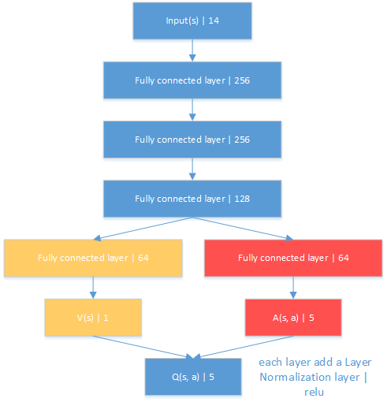

# 异步 RL 模型

由于在真实环境中或 gazebo 仿真环境下（ROS的发布订阅模式），robot的控制命令需要控制在固定的频率下，以避免出现超出robot的实际物理限制的情况，而将Q network的优化过程、priority replay memory 的优先级更新等过程与robot的神经网络控制器前向传播过程结合在一起，会造成计算时间上的不确定性。而且由于robot的控制命令通常需要控制在较低的固定频率下，神经网络的优化将不得不限制在该频率下，这无疑是浪费时间的。

理论上每个CPU核心负责处理一个actor（robot）与环境交互的所有过程，每次交互得到的单个经验将发送至replay memory。Trainer 则从replay memory 中提取一个批次的memory，并在GPU上执行神经网络的优化过程。

尝试将原始DQN扩展成为Rainbow DQN, 改进包括：
1. Double Q-Learning 代码已实现，经典环境下运行正常;
2. Priority Replay Buffer 代码（异步版本）已实现, 正常;
3. Dueling DQN 网络结构已搭建，但由于网络与原论文网络上层差别较大，正确性有待检验;
4. Distributional DQN 未实现;
5. Noisy Network 运行不正确，需要进一步处理;
6. Multi-step Learning, 已实现:
   
 

前期实验中使用的Network Structure：

除了V(s)与A(s, a)结合为Q(s, a)层之外，所有层之间皆增加了Layer Normalization层，以减轻优化压力。激活函数为relu。

实验中的整体交互结构为:

#### Trainer/Acotr/MemPool算法

下面是Trainer/Acotr/MemPool的定义, 目前有关算法的计算细节没有写.

Actor, 主要负责与env交互并控制机器人的具体行为, 每隔一定时间时从Trainer上复制Q network, 至于每轮交互得到的经验是先放到buffer中一起发送给经验库, 还是每轮都发送, 则取决于具体实现:

Replay Buffer(非优先经验回放, 就不必计算priority):

考虑到现实世界中 pioneer3dx 的实际情况，gazebo仿真器中限制robot的移动速度最高为0.75 m/s , 每次action可选增加或减少0.05m/s，由于robot后部无测距手段，所以限制robot不可倒行；转向角速度最大为 0.5 rad/s，每次action可增加或减少0.05 rad/s。加上保持当前线速度、角速度的动作，共计5个action（可选结合型的动作？），而action的执行频率被限制在15HZ。
Laser的接收频率为20Hz，并从当前最近一次激光读数的10个特定角度上抽取一组数据，经过离散化处理，与机器人的当前位置坐标x、y，目标点坐标x、y共计14维向量作为状态。

#### 可能的扩展
每次可以将4个actor（robot）运行在同一个环境之下，每个robot都会将其它的robot当作动态障碍物，这体现动态环境之处（或者这是self play?）。机器人的初始位姿（所在位置、朝向）以及目标坐标都是随机的，以此期望actor可以学习到更通用的策略，而非针对特定场景，减轻过拟合。但这样一个动态环境，很有可能造成训练难以收敛，具有较大方差，没见过并行化训练、或者异步训练，将agent放在一起的（self play可能）。理论模型可能存疑，这不满足严格的定义。

#### Problem
机器人的定位问题，当前位置以及目标位置，需要额外的定位手段（室内高精度定位如wifi定位、ziBee定位等），可避免slam问题，因为是针对未知环境。在Tai L等人的工作中[1]，使用了ROS中自带的amcl（二维环境下的概率定位系统）作为定位手段，主要用以估计robot运行时与target的距离与角度，动态环境下位姿估计可能是不准确的。（实际这里的槽点不少，既然使用amcl说明是有地图数据的，作者说实体机器人运行时，用以协助定位，也就是没使用之前提的wifi定位等（为了简化实验））。

关于robot怎么停到target，一：将机器人角速度、线速度（离散化）作为状态数据输入，或许期望目标点的最终位姿（pose、v）可以一起作为期望学习到的能力，但有个问题，robot如何获取当前的朝向角（陀螺仪以及编码器是不可靠的）； 二：不设置robot到达目标地既reset并给予reward，而是最终停下，还是依靠speed，但speed与其它状态的输入向量间差别比较大，离散整数化后区别也很大，可能需要放缩？）